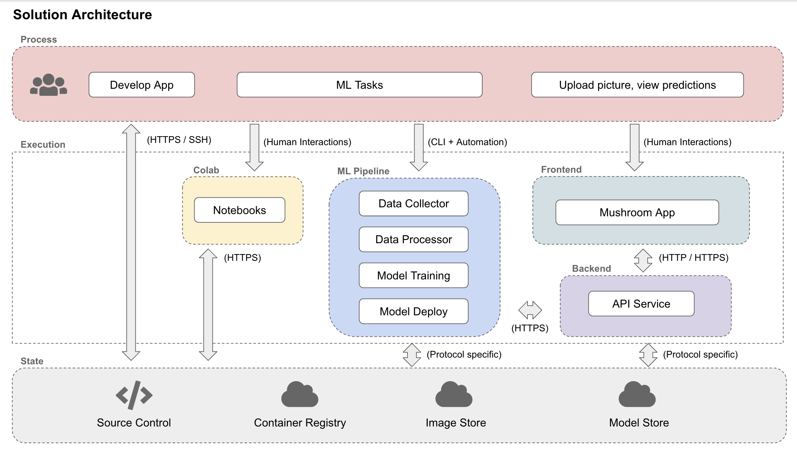
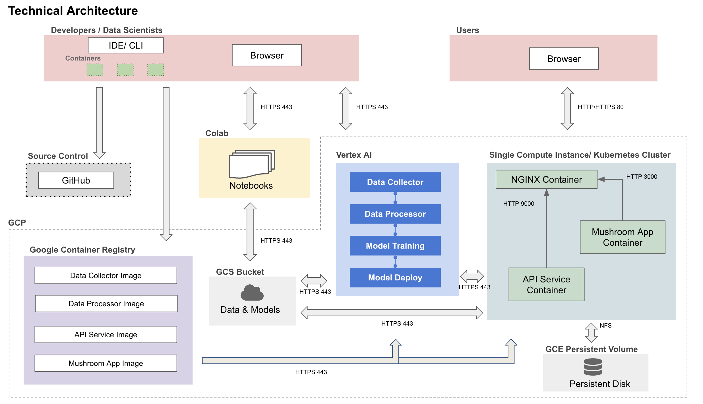
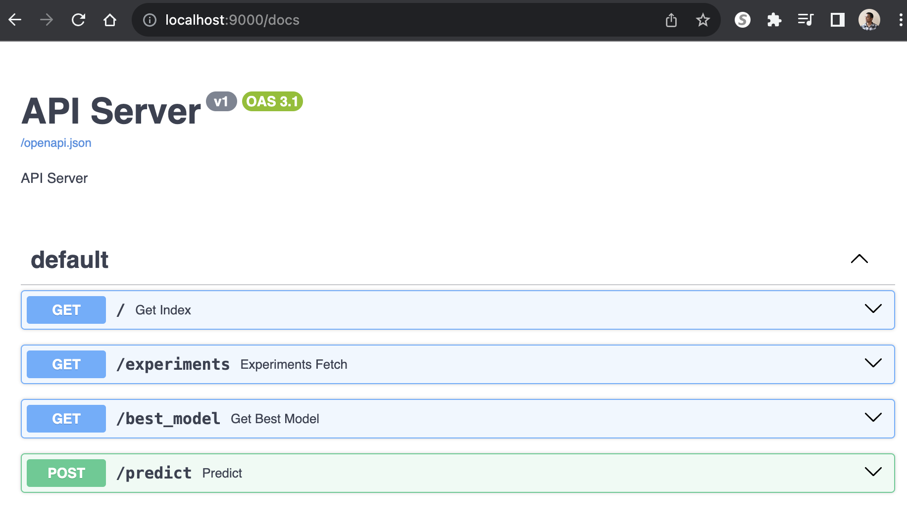

## Milestone 4 Template

```
The files are empty placeholders only. You may adjust this template as appropriate for your project.
Never commit large data files,trained models, personal API Keys/secrets to GitHub
```

#### Project Milestone 4 Organization

```
├── Readme.md
├── data # DO NOT UPLOAD DATA TO GITHUB, only .gitkeep to keep the directory or a really small sample
├── notebooks
│   └── eda.ipynb
├── references
├── reports
│   ├── CheesyAppMidterm.pdf
│   └── Statement of Work_Sample.pdf  #This is Milestone1 proposal
└── src
    ├── api-service
    ├── datapipeline
    │   ├── Dockerfile
    │   ├── Pipfile
    │   ├── Pipfile.lock
    │   ├── dataloader.py
    │   ├── docker-shell.sh
    │   ├── preprocess_cv.py
    │   └── preprocess_rag.py
    ├── docker-compose.yml
    ├── frontend
    ├── models
    │   ├── Dockerfile
    │   ├── docker-shell.sh
    │   ├── infer_model.py
    │   ├── model_rag.py
    │   └── train_model.py
    └── workflow
```

# AC215 - Milestone3 - Cheesy App


**Team Members**
Pavlos Parmigianopapas, Pavlos Ricottapapas and Pavlos Gouda-papas

**Group Name**
The Grate Cheese Group

**Project**
In this project, we aim to develop an AI-powered cheese application. The app will feature visual recognition technology to identify various types of cheese and include a chatbot for answering all kinds of cheese-related questions. Users can simply take a photo of the cheese, and the app will identify it, providing detailed information. Additionally, the chatbot will allow users to ask cheese-related questions. It will be powered by a RAG model and fine-tuned models, making it a specialist in cheese expertise.


----

### Milestone4 ###

In this milestone, we have the components for frontend, API service, also components from previous milestones for data management, including versioning, as well as the computer vision and language models.

After completions of building a robust ML Pipeline in our previous milestone we have built a backend api service and frontend app. This will be our user-facing application that ties together the various components built in previous milestones.

**Application Design**

Before we start implementing the app we built a detailed design document outlining the application’s architecture. We built a Solution Architecture and Technical Architecture to ensure all our components work together.

Here is our Solution Architecture:



Here is our Technical Architecture:




**Backend API**

We built backend api service using fast API to expose model functionality to the frontend. We also added apis that will help the frontend display some key information about the model and data. 



**Frontend**

A user friendly React app was built to identify various species of mushrooms in the wild using computer vision models from the backend. Using the app a user can take a picture of a mushroom and upload it. The app will send the image to the backend api to get prediction results on weather the mushroom is poisonous or not. 

Here are some screenshots of our app:

```Add screenshots here```

## Running Dockerfile
Instructions for running the Dockerfile can be added here.
To run Dockerfile - `Instructions here`


**Notebooks/Reports**
This folder contains code that is not part of container - for e.g: Application mockup, EDA, any 🔍 🕵️‍♀️ 🕵️‍♂️ crucial insights, reports or visualizations.

----
You may adjust this template as appropriate for your project.